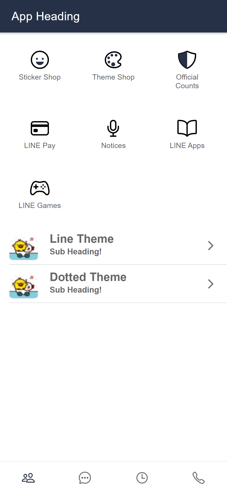
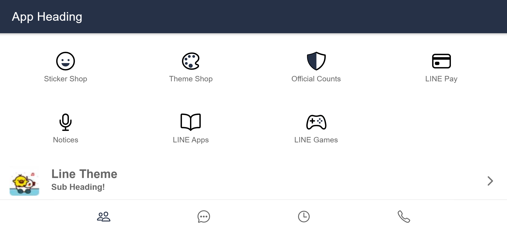

## Used Icons from Ionicons:
https://ionic.io/ionicons

## For Image cropping used:
https://www.photopea.com/

## Development Strategy:
Developed markup for Mobile View - Portrait and landscape
- For Portrait view showing 3 X 3 icons 
- For Landscape view showing 4 x 4 icons
- Primarly worked on below files:
    - src\app\tabs\tabs.page.html
    - src\app\tab1\tab1.page.html
    - src\app\tabs\tabs.page.scss
    - src\app\tab1\tab1.page.scss

## Web App rendeing
### Portrait View

### Landscape View
